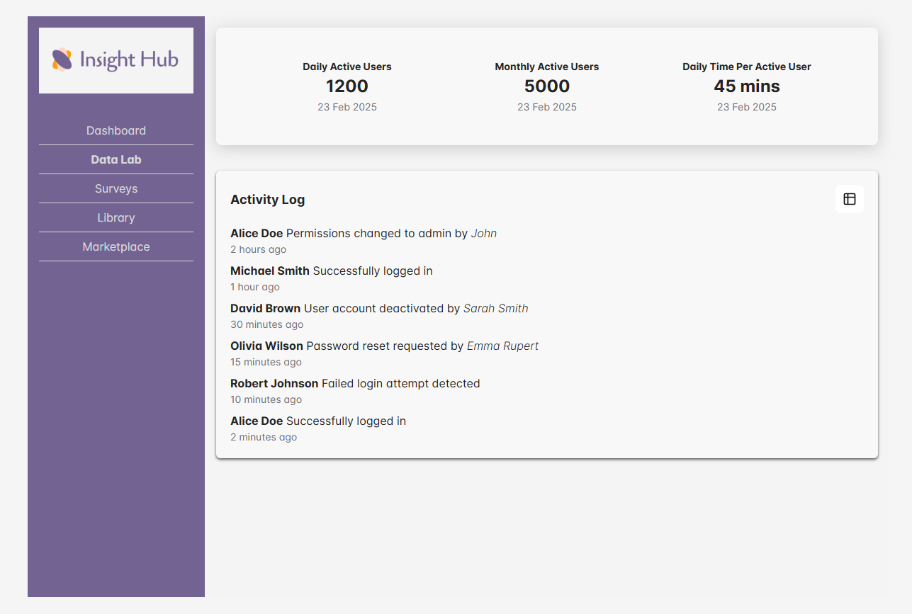

# 🚀 Micro Frontend Dashboard & Logs App  

This project is a **micro frontend architecture** built using **Vite, React, Redux, Redux-Saga, and Chakra UI**. The application consists of:  

1. **Host App (Container) - `http://localhost:3000`**  
2. **Dashboard Micro Frontend - `http://localhost:5001`**  
3. **Log Micro Frontend - `http://localhost:5002`**  


## Screenshots





Each micro frontend is deployed separately and loaded dynamically into the host app using **Module Federation**.

---

## **📦 Project Structure**
/micro-frontend-vite-react │── /InsightHub (Container Application) │── /dashboard-app (Dashboard Micro Frontend) │── /log-app (Log Micro Frontend)

---

## **⚡ Prerequisites**
Before running the project, make sure you have:  
- **Node.js v18+**  
- **npm v9+**  
- **Git** installed  

---

## **📥 Installation**
Clone the repository and install dependencies:  
```sh
git clone https://github.com/Pruthivika/micro-frontend-react-vite.git
cd micro-frontend-react-vite
```

Then install dependencies in all apps
```sh
cd InsightHub && npm install
cd ../dashboard-app && npm install
cd ../log-app && npm install
```

Build all apps at once
```sh
cd InsightHub && npm run build
```

Serve the Production Build
```sh
cd InsightHub && npm run serve
```

## **🛠️ Technologies Used**
- Vite - Fast build tool for frontend apps
- React.js - UI library for building interfaces
- Redux & Redux-Saga - State management
- Chakra UI - Component library for styling
- Module Federation - Micro frontend integration
- Highcharts - Charting library for analytics


